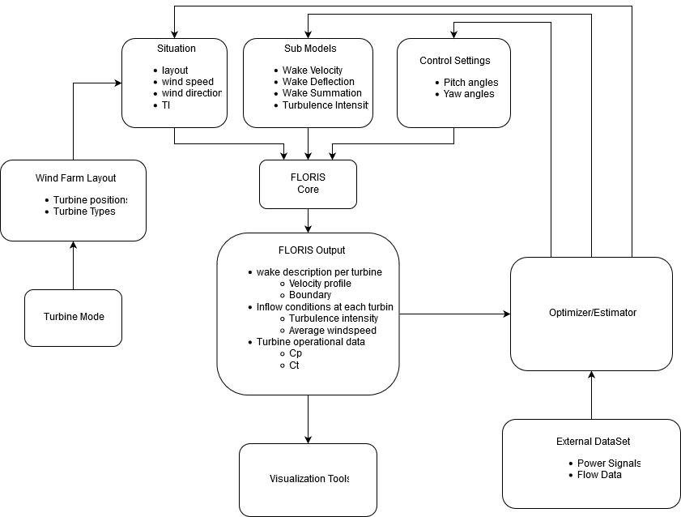
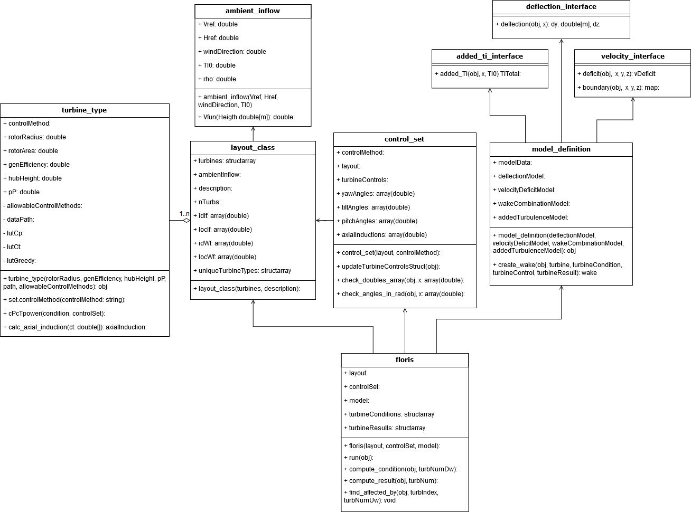

Architecture
===============

Matlab supports object oriented programming and it is used in the FLORIS package. The mathworks website has `a quick primer on objects <https://nl.mathworks.com/company/newsletters/articles/introduction-to-object-oriented-programming-in-matlab.html>`_. As you will quickly notice the matlab objects all inherit from handle, the reason for that is explained `here <https://nl.mathworks.com/help/matlab/matlab_oop/comparing-handle-and-value-classes.html>`_
FLORIS is based on several papers. Below is an image showing a draft of the current architecture:

Every top level block in this diagram corresponds to a folder in the FLORIS source code. Each arrow denotes the flow of data. This diagram is not rigorous but it does give an accurate overview.

The diagram below shows the `class diagram <https://en.wikipedia.org/wiki/Class_diagram>`_ which shows all classes and their relationship. The notation language in this diagram is called Unified Modeling Language (UML).

+------+-------------------------------+
| 0    | No instances(rare)            |
+------+-------------------------------+
| 0..1 | No instances, or one instance |
+------+-------------------------------+
| 1    | Exactly one instance          |
+------+-------------------------------+
| 1..1 | Exactly one instance          |
+------+-------------------------------+
| 0..* | Zero or more instances        |
+------+-------------------------------+
| \*   | Zero or more instances        |
+------+-------------------------------+
| 1..* | One or more instances         |
+------+-------------------------------+

